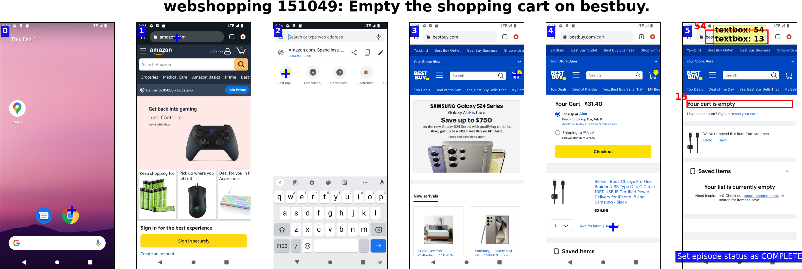

<div align="center">
    <h1>LlamaTouch: A Faithful and Scalable Testbed for Mobile UI Task Automation</h1>
</div>

<p align="center">
<!--   <a href="https://example.com">Website</a> • -->
  <a href="#dataset">Dataset</a> •
  <a href="#agentenv">AgentEnv</a> •
  <a href="#llamatouch-evaluator">Evaluator</a> •
  <a href="https://arxiv.org/abs/2404.16054">Paper</a> •
  <a href="#citation">Citation</a>
</p>


was accepted at <a href="https://uist.acm.org/2024/">ACM UIST'24</a>.
Our 30-second teaser video:

<br>
<br>

https://github.com/user-attachments/assets/2d51c1eb-9f57-4d00-9a65-9e5f57168fa1

LlamaTouch is a testbed for evaluating mobile UI automation agents in real-world mobile environments.
It compares agent execution traces with (a sequence of) annotated essential states on UI interaction traces/datasets, rather than directly comparing two concrete action sequences.
LlamaTouch achieves high evaluation accuracy while maintaining scalability.

Key features:

1. Task execution in real-world mobile environments.

2. Faithful and scalable task evaluation powered by LlamaTouch Evaluator and annotated essential states.

3. Easy task set annotation and expansion with a rich set of UI state annotation primitives and helper systems.

The overall system architecture and workflow of LlamaTouch:

<p align="center">
    
</p>

## Dataset

> [!NOTE]
> [llamatouch_task_metadata.tsv](dataset/llamatouch_task_metadata.tsv) contains the metadata of the dataset.
>
> See [docs](dataset/README.md) to explore and use the dataset.

LlamaTouch comprises 495 mobile UI automation tasks, with 102 tasks sampled from [AITW](https://arxiv.org/abs/2307.10088) and 393 self-constructed tasks from 46 popular Android applications.

Each task contains:

- **A task description**, e.g., "Reserve a rental car in Los Angeles from June 1st-7th, with a budget of up to $60 per day on Expedia."
- **A sequence of UI representations and actions** to complete the task, labeled by human annotators:
    - UI representations: Pixel-level screenshots, textual view hierarchies, Android activity names of each UI, etc.
    - Actions: Actions performed on each UI to navigate to the next UI.
- **Annotated essential states**, e.g., a textbox in the UI with the text field displaying "Your cart is empty" as shown below.

A visualized dataset sample is shown in the following figure, with actions marked by blue plus markers and essential states highlighted with red bounding boxes and numeric IDs.

<div align="center">
    
</div>

## AgentEnv

> [!NOTE]
> Check out the [doc](https://github.com/LlamaTouch/AgentEnv) to use AgentEnv.

AgentEnv bridges a mobile agent and real-world mobile environments (e.g., a real smartphone or an Android emulator) for on-device task execution.

AgentEnv provides basic APIs for completing mobile UI automation tasks, including
1. Retrieving UI representations from mobile environments.
2. Forwarding agent decisions (predicted actions) to mobile environments.

All device states are recorded during task execution and will be used in LlamaTouch Evaluator.

## LlamaTouch Evaluator

> [!NOTE]
> Check out the [doc](https://github.com/LlamaTouch/Evaluator) to use LlamaTouch Evaluator.

LlamaTouch Evaluator takes essential states from LlamaTouch dataset and agent execution traces as input.
For each task, it iterates through the agent execution trace to detect whether all annotated essential states are traversed to complete the task.

With human validation results, it can also report the accuracy of the evaluation approach.

## Citation

```
@misc{zhang2024llamatouch,
      title={LlamaTouch: A Faithful and Scalable Testbed for Mobile UI Automation Task Evaluation}, 
      author={Li Zhang and Shihe Wang and Xianqing Jia and Zhihan Zheng and Yunhe Yan and Longxi Gao and Yuanchun Li and Mengwei Xu},
      year={2024},
      eprint={2404.16054},
      archivePrefix={arXiv},
      primaryClass={cs.HC}
}
```
